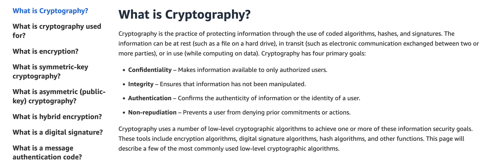
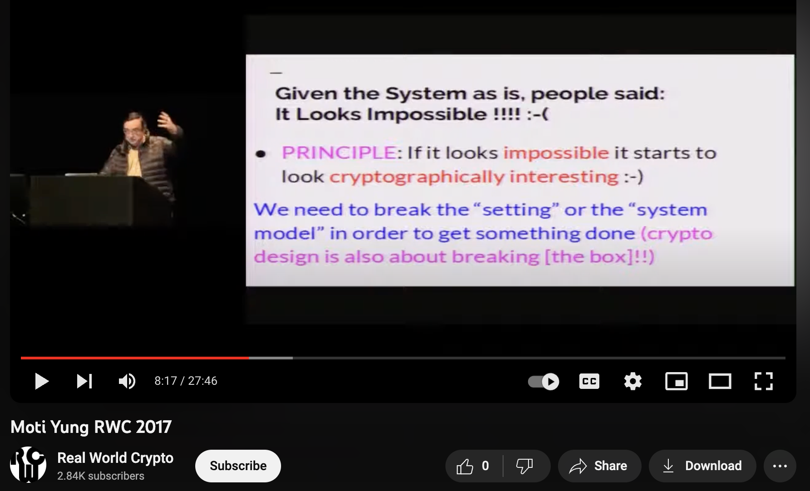

# On some less common cryptographic constructions

The picture shows two pretty opposing views on what cryptography is:

  
   

On the left, cryptography is defined as primarily a practice of encryption and signing.
This would include questions such as encryption of data at rest, protocols for encryption 
of data in transit and E2E encryption. Such a view may leave engineers (e.g., developers and 
security consultants)  wondering about what's all the fuss about, once we have found optimal 
primitives that achieve these goals.

The image on the right paints a different picture, where it's described as a science of 
making seemingly impossible things possible. This is from Moti Yung's presentation on how to
achieve TBD RWC 2017. 

In this blog post we list three unexpected properties that cryptography can deliver and inject 
into real-world systems. We hope to make things clearer for security practioners and engineers
in regard what cryptography nowdays as is and how exciting and unpredictable its future may be.

### Makwa: delegatable password hashing function

TBD 1Password whitepaper PDF mentions this hash function as a way to resolve the limitation of clients' computation bottleneck via delegation

### Slowable encoders

TBD server provably stores more than one copy of a file

### Symmetric PAKE

TBD authenticate just based on a low entropy PIN

### PoW blockchain

TBD Plug the idea of PoW to resolve double-spend conflicts

